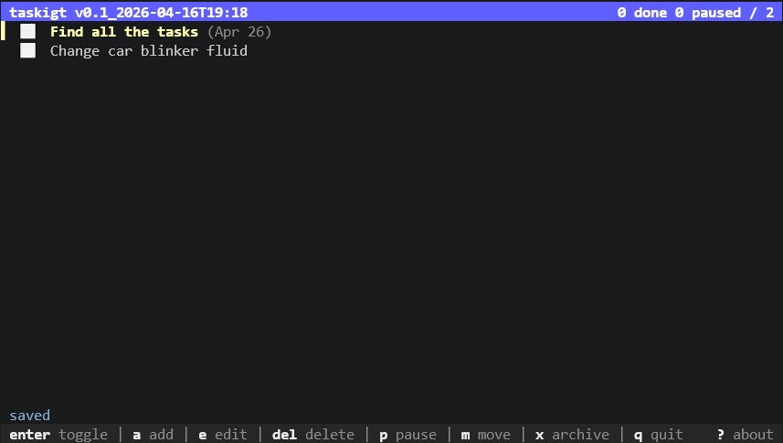

# taskigt

Mean (taskig in swedish) minimal checklist manager in the terminal, built with [Bubble Tea](https://github.com/charmbracelet/bubbletea).

## Screenshots





## Keybindings

### Normal mode

| Key | Action |
|-----|--------|
| `↑/↓` | Navigate |
| `enter` | Toggle done/undone |
| `p` | Pause/unpause task |
| `a` | Add task |
| `e` | Edit task |
| `D` | Set due date |
| `delete` | Delete selected task (confirms first) |
| `m` | Move mode — `↑/↓` reorder, `enter` confirm, `m`/`esc` cancel |
| `x` | Archive all done tasks (`x` again to undo) |
| `?` | About / language selector |
| `q` / `ctrl+c` | Quit |

### Edit screen

| Key | Action |
|-----|--------|
| `↑/↓` | Navigate fields |
| `enter` | Activate/confirm field |
| `←/→` | Move cursor within field |
| `backspace`/`delete` | Delete characters |
| `esc` | Revert field / discard changes |
| `w` | Save and exit |

### Confirmation dialog

| Key | Action |
|-----|--------|
| `y` | Confirm |
| `n` / `esc` | Cancel |

## Language

Press `?` to open the about dialog. Use `↑/↓` to switch between **English** and **Svenska**. The selection is saved automatically.

## Data

Tasks are stored as human-readable JSON. Location by platform:

| Platform | Path |
|----------|------|
| Windows | `%USERPROFILE%\.taskigt\tasks.json` |
| Linux / macOS | `~/.taskigt/tasks.json` |

Done tasks can be archived into the same file under the `archived` key.

## Build & run

```bash
make run        # run without building
make build      # build to bin/
make install    # build and install to Go bin dir (on PATH)
make test       # run tests
make clean      # remove bin/
```

Or without make:

```bash
go run ./cmd/taskigt
go build -o bin/taskigt ./cmd/taskigt
go install ./cmd/taskigt
```
